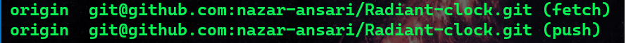

#   :dizzy: Radiant-Analog **Clock**  :dizzy:

  This Clock is made using _**HTML5**_ ,_**CSS3**_ , _**JAVASCIPT**_.
  
 * Made for Practising the _**CSS3**_ animation style **.**

###Preview:
- You can find the Source Block [Here](./source/index.html).
  

- Feel free to _**Contribute**_ to this Project with Respective to  [Developer](https://github.com/nazar-ansari) **.**

<h4>Contribution Steps:<h4>

> :warning: Make Sure to Create a `Pull Request` with Different `Branch ` name **.**

  * :one: `cd ~/` 
   
 * :two: `git clone https://github.com/nazar-ansari/Radiant-clock.git `
   
 * :three:`cd Radiant-clock/`
   
  * :four: `git remote -v`
  
  * :five:`code index.html`
  

  
  **Copyright :copyright: :** **nazar-ansari** [GNU](./LICENSE)